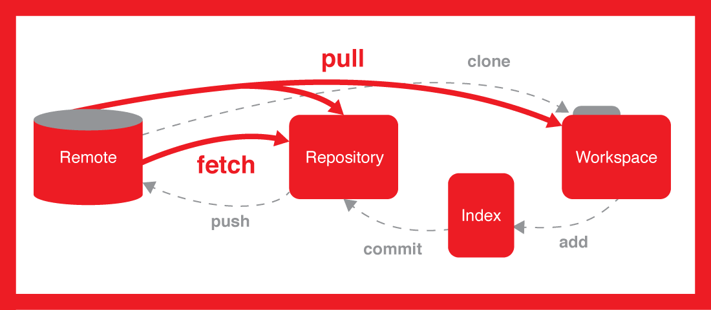
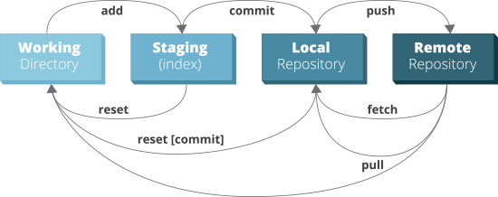

# GIT

GIT is an excellent version control system for our projects. It saves a lot many tasks/time.
Everyone (who work with projects) should use this.


## How multiple collaborators interact with a project?


## Master user and collaborators


## Project hosting websites

+ Github - https://github.com/ (You can create public projects and there is paid plan for  private projects)
 
+ Gitlab - https://gitlab.com/ (You can create private, public, internal projects for free)

+ Bitbucket - https://bitbucket.org/ (You can create private and public projects for free)



## Required basic GIT commands


>
>  Run the below commands in sequence to push the changes

| Commands  | Description |
| :--------  | :--- |
| git add . | Adding all changed files, use **git add filename.ext** to add specific one |
| git commit -am "&lt;your-commit-message&gt;" | Commiting (creating a check point) your changes, making changes ready for push operation | 
| git push -u &lt;remote-name&gt; &lt;branch-name&gt; | Update remote branch with new changes |

## add, commit, push, fetch, reset, reset - workflow




Let's have a look into a real example executed on Windows (Commnads are same for all platforms).

### git add .  - (`required`)

```bash
H:\RishikeshAgrawani\Projects\GenWork\NW\genw-dev>git add .
```

### git status - (`optional`)

```
H:\RishikeshAgrawani\Projects\GenWork\NW\genw-dev>git status
On branch master
Your branch is up to date with 'origin/master'.

Changes to be committed:
  (use "git reset HEAD <file>..." to unstage)

        modified:   src/views/em2.html
        modified:   src/views/open-file-v2.html

```

### git commit -am "updated em2.html (added support for fg & bg color)"  - (`required`)

```bash
H:\RishikeshAgrawani\Projects\GenWork\NW\genw-dev>git commit -am "updated em2.html (added support for fg & bg color)"
[master b1b3c0b] updated em2.html (added support for fg & bg color)
 2 files changed, 8 insertions(+), 8 deletions(-)

```

### git push -u origin master - (`required`)

```bash
H:\RishikeshAgrawani\Projects\GenWork\NW\genw-dev>git push -u origin master
Counting objects: 6, done.
Delta compression using up to 4 threads.
Compressing objects: 100% (6/6), done.
Writing objects: 100% (6/6), 656 bytes | 656.00 KiB/s, done.
Total 6 (delta 5), reused 0 (delta 0)
To https://gitlab.com/generator-team/nwjs/genw-dev.git
   585fab8..b1b3c0b  master -> master
Branch 'master' set up to track remote branch 'master' from 'origin'.

```

### git log - (`optional`)

```bash
H:\RishikeshAgrawani\Projects\GenWork\NW\genw-dev>git log
commit b1b3c0b30ff7d19d0dea7bad4fd00dd2a9bacadc (HEAD -> master, origin/master, origin/HEAD)
Author: Rishikesh Agrawani <rishikesh0014051992@gmail.com>
Date:   Tue Jan 1 12:39:37 2019 +0530

    updated em2.html (added support for fg & bg color)

commit 585fab836ce7cf31df11d4bedf9cfcfb3d1f5f88
Author: Rishikesh Agrawani <rishikesh0014051992@gmail.com>
Date:   Tue Jan 1 11:41:37 2019 +0530

    updated code, details related to email manager calling signature

commit 84b26ec03c3ba6df76ab57bb6f312479dac9d467
Author: Rishikesh Agrawani <rishikesh0014051992@gmail.com>
Date:   Mon Dec 31 20:22:39 2018 +0530

    added a simple elements attribs related example

commit 8a5c9283b852cd744e8048f59edfd2f003031f30
Author: Rishikesh Agrawani <rishikesh0014051992@gmail.com>
Date:   Sun Dec 30 15:28:00 2018 +0530

    fixed new entry related issue in JSON file

commit 570b2e1ac38388cbc0fd3a1367b4ae2504d26392
Author: Rishikesh Agrawani <rishikesh0014051992@gmail.com>
Date:   Sun Dec 30 13:52:04 2018 +0530

    fixed a great issue, path => fs, many more

commit 63b6d5d8804165e86148e68f39ecf8bce6754c64
Author: Rishikesh Agrawani <rishikesh0014051992@gmail.com>
Date:   Fri Dec 28 20:25:10 2018 +0530

    updated code

commit 199ff50f6b3d168026c1798a4812c8568a4b7388
Author: Rishikesh Agrawani <rishikesh0014051992@gmail.com>
Date:   Fri Dec 28 17:41:14 2018 +0530

    updated details

commit d92c8aa5b3d89d625c36ce7bed4c79e4983a821a
Author: Rishikesh Agrawani <rishikesh0014051992@gmail.com>
Date:   Fri Dec 28 12:03:15 2018 +0530

```

## Another sample examples

> Let's have a look at below sample examples.

### Example 1 

> push to `master` branch of remote named origin

+ git add .

+ git commit -am "added srcapping() method to Scrap class"

+ git push -u origin master

### Example 2 

> push to `working` branch of remote named `origin`

+ git add .

+ git commit -am "added display() method to the same class"

+ git push -u origin master

## Basic important & optional commands 

> **Note:** you can run these commands at any time.

| Commands   | Decription|
| ---------- | --- |
| git log    | To list out the commits |
| git status | To check the status (list of files ready for push operation etc.) |
| git branch | To check the current working branch |

